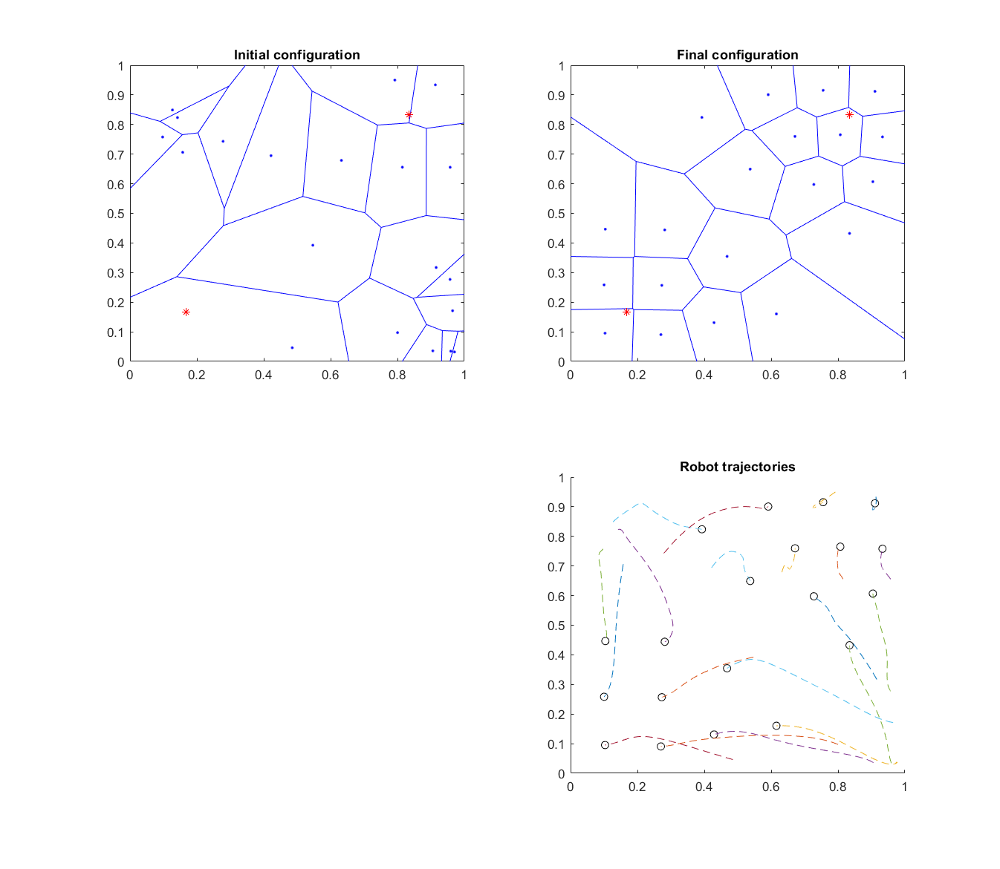
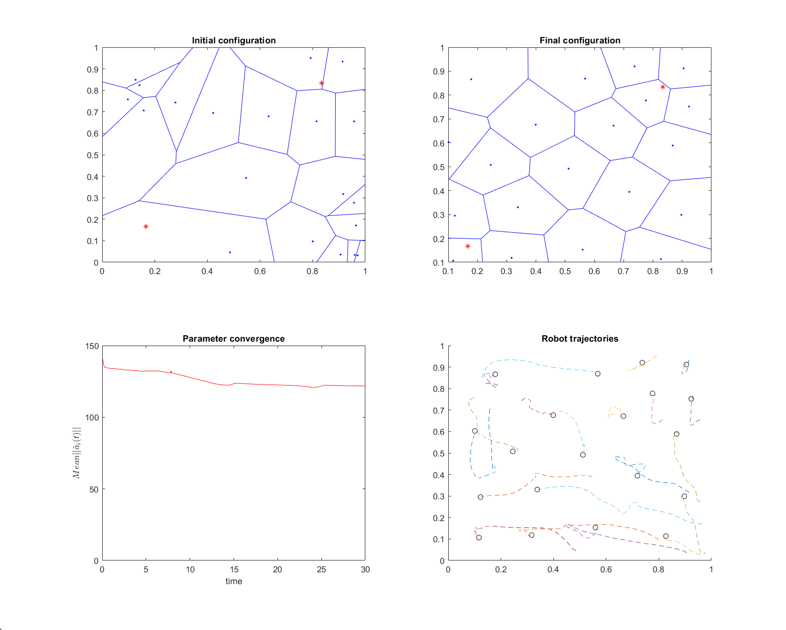
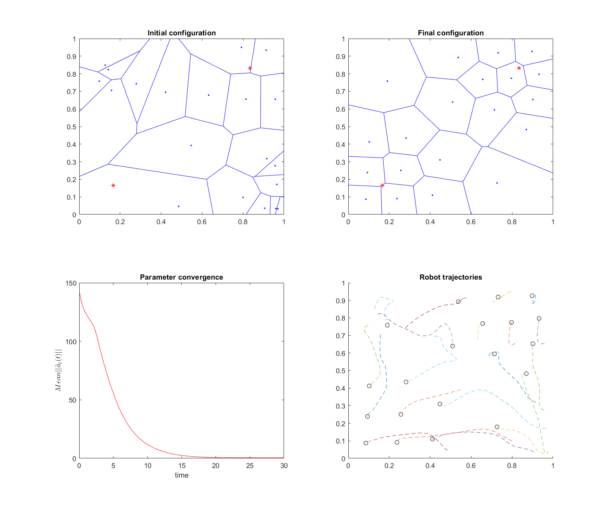

# Multi-Robot systems project

This respository implements the algorithm proposed in the paper ["Decentralized, adaptive coverage control for networked robots"](http://web.mit.edu/nsl/www/preprints/Adaptive_Coverage08.pdf).

## Results
* **Controller with known sensory distribution**

We first show result of the base case where the sensory information is assumed to be known for comparison with other two implemented controllers where the sensory information is not know in advance. The final configuration in this case is the optimal configuration.

* **Basic (Non-concensus) controller**

In the basic controller we see that robot density near the peaks of the two gaussians represented by red \*. In this case each robot updated its sensory function estimate only based on its own sensor information. Also note from the third plot that the parameter convergence is to true parameter vector a is slow so the final configuration is near-optimal and not optimal.

* **Concensus controller**

In the consensus controller case each robot updated its sensory function estimate based on its own sensor information as well as the sensory estimates of its neighbors on the
delauny triangulation graph. We can see that the robots achieve final configuration similar to that of the optmial configuration achieved with exactly known
sensory information. This can also be seen from the third plot(paramter convergence) where the mean of norm of parameter error converges to 0. Hence we achieve near optimal configuration.

* **Position error convergence**

The estimated position error is the distance of the robot from the centroid of its voronoi cell that is calculated using the current paramter estimate at a given time step. The true position error is the distance of the robot from the centroid of its voronoi cell that is calculated using the true paramter distribution at a given time step. The estimated position error and true position error averaged over all the robots in the network is shown for the network of 20 robots for both the basic and parameter
consensus controllers that were implemented.

**Note:** The true position error converges to within 0.01 distance error only for the parameter consensus controller. However, in accordance with Theorem 1 and 2, the estimated
error converges to zero in both cases. This shows that both controllers achieve near optimal configuration. However only the paramter consensus controller has trajectory
rich enough to get accurate enough parameter estimate and achieve close to optimal final configuration. 
